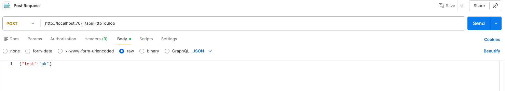
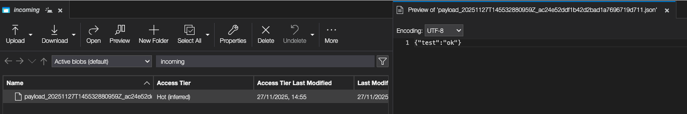

# HttpToBlob Azure Function

Exposes an HTTP REST endpoint which accepts any valid JSON payload and writes it to Azure Blob Storage. Use cases: Simple integration for external services that can't communicate directly with EventHub.

## Environment
- Python 3.8+ 
- Set environment variable `AZURE_STORAGE_CONNECTION_STRING` to an appropriate connection string (or configure in Azure App Settings).
- Optional: `BLOB_CONTAINER_NAME` (defaults to `incoming`).

## Local development

1. Install the recommended plugins from the .vs_code directory, and start the Azurite Service


2. Update `local.settings.json` with your connection string or export env var which you can get from Azure Storage Explorer. An example has already been provided in local.settings.json or if you don't want to store in your GIT Repo set the following environment variables:

```bash
export AZURE_STORAGE_CONNECTION_STRING="<your-connection-string>"
export BLOB_CONTAINER_NAME="incoming"
```

3. ```chmod +x ./init_env.sh```

The init_env.sh sets up a python virtual environment, installs the required packages, and executes the AzureTools func start command to create a localhost runtime. Give it execution permission on your computer.

```bash
set -e
python3 -m venv .venv || true
source .venv/bin/activate
pip install -r requirements.txt
func start
```

4. Run the Function locally with the Azure Functions Core Tools using the init_env.sh script:
_note:_ you need a nix system to run this, WSL2, linux on Docker, or Mac.

```bash
./init_env.sh
```

# POST a JSON payload to the function endpoint 

## Via curl:

```bash
curl -X POST http://localhost:7071/api/HttpToBlob -H "Content-Type: application/json" -d '{"test":"ok"}'
```

## Using Postman


## Review the results in Azure Storage Explorer


# Notes
- This scaffold uses `AZURE_STORAGE_CONNECTION_STRING`. In production prefer using managed identity or secure Key Vault and set the `AzureWebJobsStorage` correctly.
